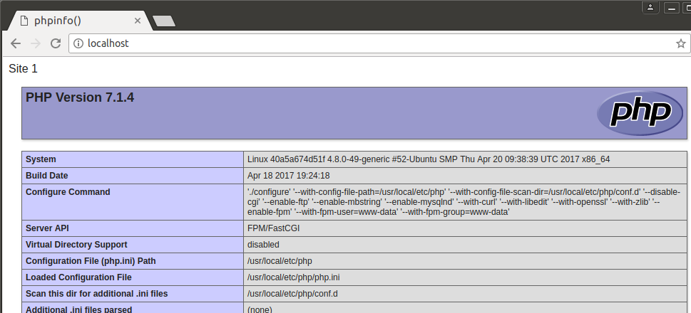

DNMP（Docker + Nginx + MySQL + PHP7/5）是一款全功能的**LNMP 一键安装程序**。

DNMP 项目特点：

1. `100%`开源
2. `100%`遵循 Docker 标准
3. 支持**多版本 PHP**随意切换（PHP5.4、PHP5.6、PHP7.0、PHP7.2)
4. 支持绑定任意**多个域名**
5. 支持**HTTPS 和 HTTP/2**
6. PHP 源代码位于 host 中
7. MySQL data 位于 host 中
8. 所有配置文件可在 host 中直接修改
9. 所有日志文件可在 host 中直接查看
10. 内置**完整 PHP 扩展安装**命令
11. 实际项目中应用，确保`100%`可用
12. 一次配置，**Windows、Linux、MacOs**皆可用

## 1.项目结构

目录说明：

```
/
├── conf                    配置文件目录
│   ├── conf.d              Nginx用户站点配置目录
│   ├── nginx.conf          Nginx默认配置文件
│   ├── mysql.cnf           MySQL用户配置文件
│   ├── php-fpm.conf        PHP-FPM配置文件（部分会覆盖php.ini配置）
│   └── php.ini             PHP默认配置文件
│   └── redis.conf          Redis默认配置文件
├── Dockerfile              PHP镜像构建文件
├── extensions              PHP扩展源码包
├── docker-compose.yml      PHP最新版docker-compose项目文件
├── log                     Nginx日志目录
├── mysql                   MySQL数据目录
├── php                     PHP各版本的Dockerfile目录
└── www                     PHP代码目录
└── source.list             Debian源文件
```

结构示意图：


## 2. 快速使用

1. 本地安装`git`、`docker`和`docker-compose`。
2. `clone`项目：
   ```
   $ git clone https://github.com/yuleicc/dnmp.git
   ```
3. 如果不是`root`用户，还需将当前用户加入`docker`用户组：
   ```
   $ sudo gpasswd -a ${USER} docker
   ```
4. 拷贝环境配置文件`.env.sample`为`.env`，启动：
   ```
   $ cd dnmp
   $ cp env.sample .env
   $ docker-compose up
   ```
5. 在浏览器中访问 `localhost`，会看到类似如下的输出：



这是项目的演示效果，PHP 代码在这个目录：`./www/site1/`。

要修改端口、日志文件位置、以及是否替换 source.list 文件等，请修改.env 文件，然后重新构建：

```
$ docker-compose build          # 重建全部服务
```

## 3. 使用其他 PHP 版本？

默认情况下，我们启动的是**最新版本的 PHP**，命令如下：

```
$ docker-compose up
```

## 4. HTTPS 和 HTTP/2

本项目的演示站点有两个：

- http://www.site1.com (同 http://localhost)
- https://www.site2.com

要预览这两个站点，请在主机的`hosts`文件中加上如下两行：

```
127.0.0.1 www.site1.com
127.0.0.1 www.site2.com
```

然后通过浏览器这两个地址就能看到效果，其中：

- Site1 和 localhost 是同一个站点，是经典的 http 站，
- Site2 是自定义证书的 https 站点，浏览器会有安全提示，忽略提示访问即可。

## 5. 使用 Log

Log 文件生成的位置依赖于 conf 下各 log 配置的值。

### 5.1 Nginx 日志

Nginx 日志是我们用得最多的日志，所以我们单独放在根目录`log`下。

`log`会目录映射 Nginx 容器的`/var/log/dnmp`目录，所以在 Nginx 配置文件中，需要输出 log 的位置，我们需要配置到`/var/log/dnmp`目录，如：

```
error_log  /var/log/dnmp/nginx.site1.error.log  warn;
```

### 5.1 PHP-FPM 日志

大部分情况下，PHP-FPM 的日志都会输出到 Nginx 的日志中，所以不需要额外配置。

如果确实需要，可按一下步骤开启。

1. 在主机中创建日志文件并修改权限：
   ```bash
   $ touch log/php-fpm.error.log
   $ chmod a+w log/php-fpm.error.log
   ```
2. 主机上打开并修改 PHP-FPM 的配置文件`conf/php-fpm.conf`，找到如下一行，删除注释，并改值为：
   ```
   php_admin_value[error_log] = /var/log/dnmp/php-fpm.error.log
   ```
3. 重启 PHP-FPM 容器。

### 5.2 MySQL 日志

因为 MySQL 容器中的 MySQL 使用的是`mysql`用户启动，它无法自行在`/var/log`下的增加日志文件。所以，我们把 MySQL 的日志放在与 data 一样的目录，即项目的`mysql`目录下，对应容器中的`/var/lib/mysql/`目录。

```bash
slow-query-log-file     = /var/lib/mysql/mysql.slow.log
log-error               = /var/lib/mysql/mysql.error.log
```

以上是 mysql.conf 中的日志文件的配置。

## 6. 使用 composer

在宿主机中自己配置 composer，避免 PHP 容器变得庞大。

## 7. phpmyadmin 和 phpredisadmin

本项目默认在`docker-compose.yml`中开启了用于 MySQL 在线管理的*phpMyAdmin*，以及用于 redis 在线管理的*phpRedisAdmin*，可以根据需要修改或删除。

### 7.1 phpMyAdmin

phpMyAdmin 容器映射到主机的端口地址是：`8091`，所以主机上访问 phpMyAdmin 的地址是：

```
http://localhost:8091
```

MySQL 连接信息：

- host：(本项目的 MySQL 容器网络)
- port：`3306`
- username：（手动在 phpmyadmin 界面输入）
- password：（手动在 phpmyadmin 界面输入）

### 7.2 phpRedisAdmin

phpRedisAdmin 容器映射到主机的端口地址是：`8092`，所以主机上访问 phpMyAdmin 的地址是：

```
http://localhost:8092
```

Redis 连接信息如下：

- host: (本项目的 Redis 容器网络)
- port: `6379`

## 8 使用 XDEBUG 调试

默认情况下，我们已经安装了 Xdebug 扩展，但并未在 php.ini 中配置启用。

要使用 xdebug 调试，在 php.ini 文件最后加上这几行：

```
[XDebug]
xdebug.remote_enable = 1
xdebug.remote_handler = "dbgp"
xdebug.remote_host = "172.17.0.1"
xdebug.remote_port = 9000
xdebug.remote_log = "/var/log/dnmp/php.xdebug.log"
```

然后重启 PHP 容器。

## License

MIT
